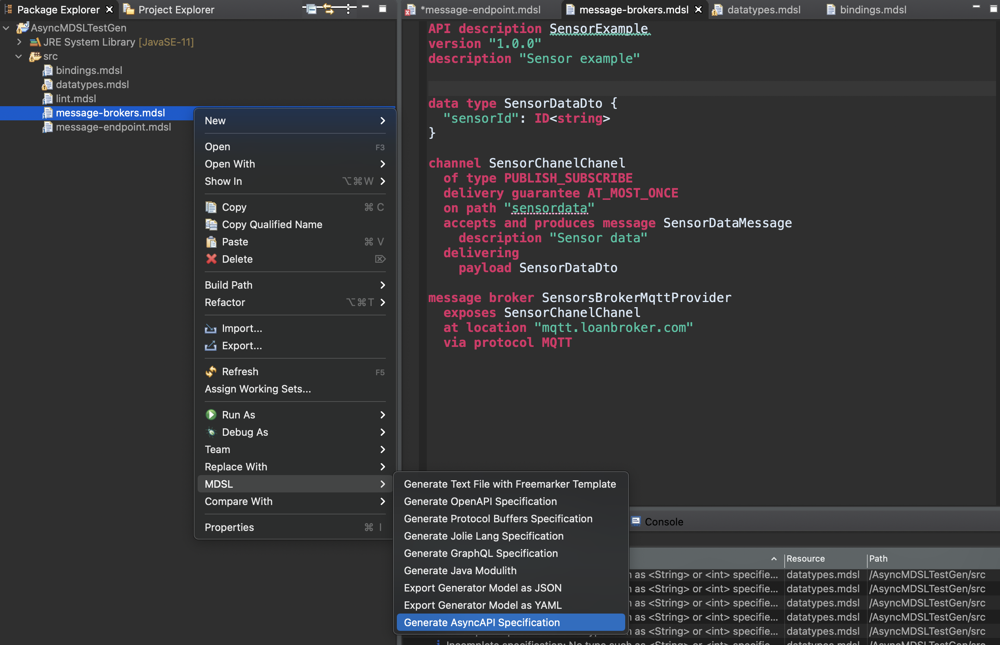

[MDSL Home](../index) &mdash; [AsyncMDSL Language Reference](../async-mdsl) &mdash; [MDSL Tools Overview](../tools)

AsyncAPI Specification Generator
=================================

_Note:_ The status of this generator, contributed by Giacomo Di Liberali, is [*Technology Preview*](https://microservice-api-patterns.org/patterns/evolution/ExperimentalPreview.html). 

The AsyncMDSL plugin for Eclipse allows API designers to generate [AsyncAPI specifications](https://www.asyncapi.com/docs/specifications/2.0.0) out of AsyncMDSL service contracts.

## Usage
You can generate the AsyncAPI specification out of an MDSL model by using the MDSL [Eclipse plugin](../tools#eclipse-plugin). You will find the generator in the MDSL context menu:

Hint: the output will be created into the `src-gen` folder which is located in the projects root directory. Look for `.yaml` files corresponding to the `.mdsl` input.

## AsyncAPI mapping

Each AsyncMDSL concept is mapped to one, or a combination of more specification objects in AsyncAPI:

|        AsyncMDSL           |                                                                                                                                                      AsyncAPI                                                                                                                                                                                                       |                                                                                                     Description                                                                                                    |
|:--------------------------:|:-------------------------------------------------------------------------------------------------------------------------------------------------------------------------------------------------------------------------------------------------------------------------------------------------------------------------------------------------------------------:|:------------------------------------------------------------------------------------------------------------------------------------------------------------------------------------------------------------------:|
| Service Specification      | [AsyncAPI Object](https://www.asyncapi.com/docs/specifications/2.0.0#A2SObject), [AsyncAPI Version String](https://www.asyncapi.com/docs/specifications/2.0.0#A2SVersionString), [AsyncAPI Info Object](https://www.asyncapi.com/docs/specifications/2.0.0#infoObject) and [Components Object](https://www.asyncapi.com/docs/specifications/2.0.0#componentsObject) | Each serviceSpecification represent a group of channels, and contains global available information such as the version and a description, and furthermore it is the container of all the other components.         |
| OneWay Channel             | [Operation Object](https://www.asyncapi.com/docs/specifications/2.0.0#operationObject)                                                                                                                                                                                                                                                                              | An operation represent a channel, with path, parameters and message schema. In AsyncAPI channels' names are their paths.                                                                                           |
| Request-Reply Channel      | A pair of [Channel Item Object](https://www.asyncapi.com/docs/specifications/2.0.0#channelItemObject)                                                                                                                                                                                                                                                               | A Request-Reply Channel is mapped into a pair of separate channels, each with its own path.                                                                                                                        |
| Channel parameter          | [Parameter Object](https://www.asyncapi.com/docs/specifications/2.0.0#parameterObject)                                                                                                                                                                                                                                                                              | Each object describes a single parameter included in a channel path.                                                                                                                                               |
| Message                    | [Message Object](https://www.asyncapi.com/docs/specifications/2.0.0#messageObject)                                                                                                                                                                                                                                                                                  | Represent a message that flows through a channel. It provides a place to document how and why messages are produced and consumed.                                                                                  |
| Channel binding            | [Operation Binding Object](https://www.asyncapi.com/docs/specifications/2.0.0#operationBindingsObject)                                                                                                                                                                                                                                                              | Allows the definition of protocol-specific parameters for a Message Channel.                                                                                                                                       |
| Broker binding             | [Server Bindings Object](https://www.asyncapi.com/docs/specifications/2.0.0#serverBindingsObject)                                                                                                                                                                                                                                                                   | Allows the definition of protocol-specific parameters for a Message Broker.                                                                                                                                        |
| Data types                 | [Schema Object](https://www.asyncapi.com/docs/specifications/2.0.0#schemaObject)                                                                                                                                                                                                                                                                                    | Allows the definition of input and output data types.                                                                                                                                                              |
| Correlation Id WhereClause | [Correlation ID Object](https://www.asyncapi.com/docs/specifications/2.0.0#correlationIdObject)                                                                                                                                                                                                                                                                     | Specifies an identifier at design time that can used for message tracing and correlation.                                                                                                                          |
| Datatype Type Reference    | [Reference Object](https://www.asyncapi.com/docs/specifications/2.0.0#referenceObject)                                                                                                                                                                                                                                                                              | Allows referencing other data types in the specification.                                                                                                                                                          |
| Message Broker             | [Server Object](https://www.asyncapi.com/docs/specifications/2.0.0#serverObject)                                                                                                                                                                                                                                                                                    | Represents a Message Broker using a single protocol. If a Message Broker supports multiple protocols, a copy of it will be created for each distinct protocol in a separate `.yml` file. <!-- .yaml or -yaml? -->                          |
| Endpoints                  |                                                                                                                                                                                                                                                                                                                                                                     | AsyncAPI does not support Message Endpoints.                                                                                                                                                                       |

## Full Example

~~~
API description HealthcareExample
version "1.0.0"

data type MeasurementDTO { "id": ID<int>, "type": D<string>, "value": D<double> }

data type HeadersDTO { 
    "tenantId": ID<int>,
    "messageId": ID<string>?,
    "apiKey": ID<string>? 
}
		

channel PatientMeasurements
of type PUBLISH_SUBSCRIBE, DATA_TYPE
delivery guarantee AT_LEAST_ONCE
description "Notifies whenever a new measurement comes"
on path "/patients/${patientId}/measurement"
	with patientId: int, "The patient identifier" 
produces message Measurement
	delivering
		headers HeadersDTO
		payload MeasurementDTO as EVENT_MESSAGE
	where 
		MESSAGE_EXPIRES in 60m

channel EnqueueTask
request message EnqueueTaskRequest
	on path "/patients/${patientId}/tasks"
	with patientId: int, "The patient identifier" 
	expecting 
		headers HeadersDTO
		payload P
reply message EnqueueTaskReply
	on path "/tasks/${taskId}/complete"
		with taskId: int, "The task identifier" 
	delivering payload P
	where 
		CORRELATION_ID is "$message.header#/messageId"

	
message broker BrokerExample
description "Expose channels under AMQP"
exposes 
	EnqueueTask,
	PatientMeasurements
		at location "amqp.myhealthcare.org"
		via protocol AMQP
		bindings {
			"qos": 1
		}
~~~

For the AsyncMDSL contract above, the generator produces the following AsyncAPI specification:

~~~yml
asyncapi: '2.0.0'
info:
  title: HealthcareExample
  version: "1.0.0"
  description: |
    No description specified
servers:
  BrokerExample:
    url: amqp.myhealthcare.org
    protocol: AMQP
    description: Expose channels under AMQP
    bindings:
      amqp:
        qos:
          1
channels:
  /patients/${patientId}/tasks:
    parameters:
      patientId:
        description: The patient identifier
        schema:
          type: integer
    subscribe:
      description: |
        
        No description specified
        
        Delivering guarantee: UNKNOWN.
        
        Request channel. Reply channel is [EnqueueTaskReply](#operation-publish-/tasks/${taskId}/complete)
          
      operationId: enqueueTaskRequest
      message: 
        $ref: '#/components/messages/EnqueueTaskRequest'
  /tasks/${taskId}/complete:
    parameters:
      taskId:
        description: The task identifier
        schema:
          type: integer
    publish:
      description: |
        
        No description specified
        
          Where:
          - CORRELATION_ID is "$message.header#/messageId"
          
        Reply channel. Request channel is [EnqueueTaskRequest](#operation-subscribe-/patients/${patientId}/tasks)
        
      operationId: enqueueTaskReply
      message: 
        $ref: '#/components/messages/EnqueueTaskReply'
  /patients/${patientId}/measurement:
    parameters:
      patientId:
        description: The patient identifier
        schema:
          type: integer
    publish:
      description: | 
      
        Notifies whenever a new measurement comes
        
        Delivering guarantee: AT_LEAST_ONCE.
        Where:
        - MESSAGE_EXPIRES in 60m
        
        One way channel (does not expect reply).
        
        
      operationId: measurementPublish
      message: 
        $ref: '#/components/messages/Measurement'
      
components:
  messages:
    Measurement:
      name: Measurement
      title: Measurement
      description: |
        
        No description specified
        
        
      payload:
          $ref: '#/components/schemas/MeasurementDTO'
      headers:
         unnamedParameter24:
           $ref: '#/components/schemas/HeadersDTO'
    EnqueueTaskRequest:
      name: EnqueueTaskRequest
      title: Enqueue Task Request
      description: |
        
        No description specified

        
        Request message. Reply message is *EnqueueTaskReply*. 
      
      payload:
        type: object
        unnamedParameter25:
          type: object
      headers:
         unnamedParameter26:
           $ref: '#/components/schemas/HeadersDTO'
    EnqueueTaskReply:
      name: EnqueueTaskReply
      title: Enqueue Task Reply
      description: |

        No description specified
        
        
        Reply message. Request message is *EnqueueTaskRequest*. 
        
      correlationId:
        location: '$message.header#/messageId'
      payload:
        type: object
        unnamedParameter27:
          type: object
  schemas:
    MeasurementDTO:
      type: object
      required:
        -  'id'
        -  'type'
        -  'value'
      properties:
        'id':
          type: integer
        'type':
          type: string
        'value':
          type: number
    HeadersDTO:
      type: object
      required:
        -  'tenantId'
      properties:
        'tenantId':
          type: integer
        'messageId':
          type: string
        'apiKey':
          type: string

~~~

## Validation and code generation

You can use the [AsyncAPI Playground](https://playground.asyncapi.io/) to validate generated specifications. 

You can also test code generation using the [asyncapi/generator](https://github.com/asyncapi/generator) running the following command (assuming an `asyncapi.yaml` file exists in the current directory), for instance: <!-- how does the command look like w/o Docker? -->

~~~
docker run --rm -it \
    -v ${PWD}/asyncapi.yaml:/app/asyncapi.yml \
    -v ${PWD}/output:/app/output \
    asyncapi/generator -o ./output asyncapi.yml @asyncapi/html-template --force-write
~~~

Once complete, an `output` folder will be created  in the current directory containing the generated skeleton.

Alternative templates are:

- `@asyncapi/java-spring-template`
- `@asyncapi/html-template`
- `@asyncapi/nodejs-template`

More information on the `asyncapi-generator` that we used in this example can be found in its [GitHub repository](https://github.com/asyncapi/generator).

## Known limitations

- The generator does not support security policies.
- A channel can only transfer messages of one data type.
- The generator does not work when invoked in the Command Line Interface (CLI). 

<!-- 
Xtext/Xtend problem: generated class experiences NullPointer exception in 
io.mdsl.generator.asyncapi.AsyncApiGenerator.compile(AsyncApiGenerator.java:160), line is: 
QualifiedName _fullyQualifiedName = this._iQualifiedNameProvider.getFullyQualifiedName(serviceSpecificationInstance);
-->

# Other Generators
Also checkout our other generators:

* [OpenAPI generator](./open-api)
* [Protocol Buffers generator](./protocol-buffers)
* [GraphQL generator](./graphql)
* [Java "modulith" generator](./java)
* [Jolie generator](./jolie)
* [Arbitrary textual generation with Freemarker](./freemarker)

# Site Navigation

* Back to [AsyncMDSL language reference](../async-mdsl).
* [Quick reference](./../quickreference), [tutorial](./../tutorial), [tools page](./../tools)
* Language specification: 
    * Service [endpoint contract types](./../servicecontract) and [data contracts (schemas)](./../datacontract). 
    * [Bindings](./../bindings) and [instance-level concepts](./../optionalparts). 
* Back to [MDSL homepage](./../index).

*Copyright: See [license information](https://github.com/Microservice-API-Patterns/MDSL-Specification/blob/master/LICENSE).*
