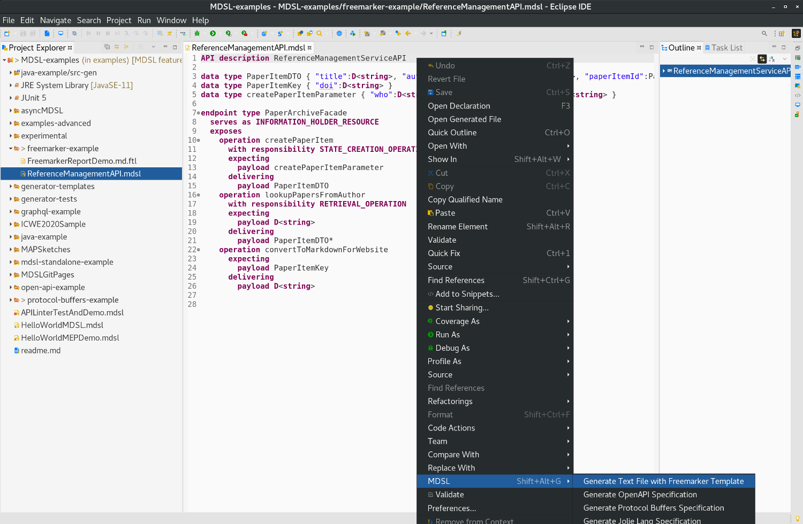
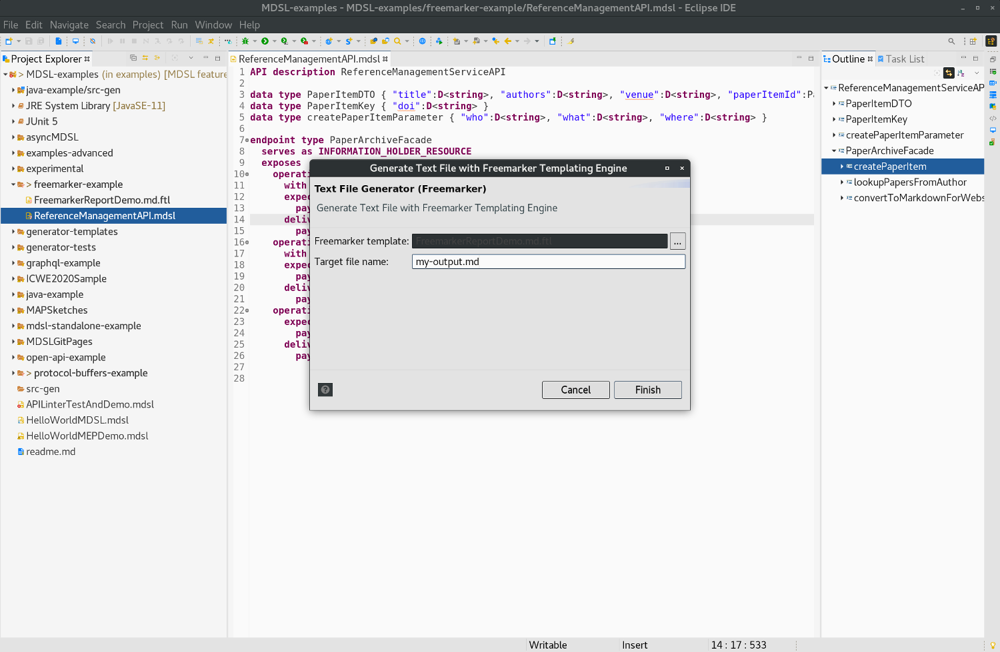
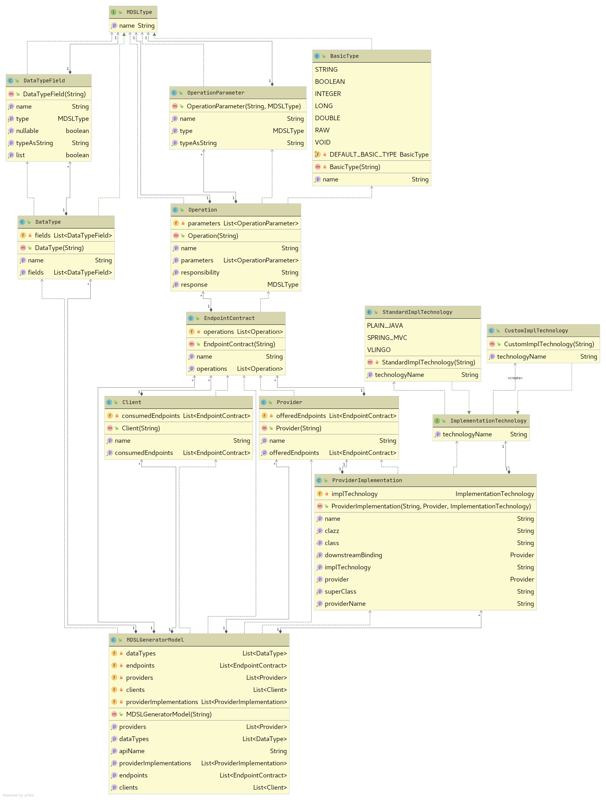

[Tools Overview](./../tools), [OpenAPI](./open-api), [Protocol Buffers](./protocol-buffers), [GraphQL](./graphql), [Jolie](./jolie), [Java](./java), [AsyncAPI](./async-api)

Arbitrary Text Generation with Freemarker Templates
===================================================
The MDSL Eclipse plugin and the CLI allow API designers to generate arbitrary text files out of MDSL by using a [Freemarker](https://freemarker.apache.org/) template.

## Usage
You can generate any text out of an MDSL model by using the [Eclipse plugin](./../tools#eclipse-plugin) or our [CLI](./../tools#command-line-interface-cli-tools).

In Eclipse you find the generator in the MDSL context menu:

<a href="./../media/eclipse-freemarker-generator-context-menu.png"></a>

<a href="./../media/eclipse-freemarker-generator-dialog.png"></a>

The following command generates the Java code in case you work with the CLI:

```bash
./mdsl -i model.mdsl -g text template.md.ftl -f my-report.md
```

_Hint:_ Both tools generate the output into the `src-gen` folder which is located in the projects root directory (Eclipse) or the directory from which the `mdsl` command has been called (CLI). Both tools create the directory automatically in case it does not already exist.

## Example
The following example illustrates what the generator can produce for an exemplary freemarker template and MDSL contract.

You find the complete sources (incl. generated text file) of this example [here](https://github.com/Microservice-API-Patterns/MDSL-Specification/tree/master/examples/freemarker-example).

The following MDSL model, taken from this [blogpost](https://ozimmer.ch/practices/2020/06/10/ICWEKeynoteAndDemo.html), illustrates the generator usage:

```
API description ReferenceManagementServiceAPI

data type PaperItemDTO { "title":D<string>, "authors":D<string>, "venue":D<string>, "paperItemId":PaperItemKey }
data type PaperItemKey { "doi":D<string> }
data type createPaperItemParameter { "who":D<string>, "what":D<string>, "where":D<string> }

endpoint type PaperArchiveFacade
  serves as INFORMATION_HOLDER_RESOURCE
  exposes
    operation createPaperItem
      with responsibility STATE_CREATION_OPERATION
      expecting
        payload createPaperItemParameter
      delivering
        payload PaperItemDTO
    operation lookupPapersFromAuthor
      with responsibility RETRIEVAL_OPERATION
      expecting
        payload D<string>
      delivering
        payload PaperItemDTO*
    operation convertToMarkdownForWebsite
      expecting
        payload PaperItemKey
      delivering
        payload D<string>
```

Let us use the following very basic Freemarker template to generate some exemplary output from the above MDSL:

```ftl
# Report for MDSL specification ${fileName}

## Endpoint Types 

The API description ${genModel.apiName} features the following endpoint types (a.k.a. service contracts): 

<#list genModel.endpoints as endpoint>
* ${endpoint.name} 
</#list>
```

The template simply generates a markdown report listing the available endpoints.

Applied to the `ReferenceManagementServiceAPI` description above, the generator produces the following markdown file:

```markdown
# Report for MDSL specification ReferenceManagementAPI.mdsl

## Endpoint Types 

The API description ReferenceManagementServiceAPI features the following endpoint types (a.k.a. service contracts): 

* PaperArchiveFacade
```

You find the complete sources (incl. generated text file) of this and other examples [here](https://github.com/Microservice-API-Patterns/MDSL-Specification/tree/master/examples/freemarker-example).

The entire MDSL grammar is available as a data model to the Freemarker templating feature.  

<!-- removed in V.511 (example folders merged):
More examples of Freemarker templates can be found [here](https://github.com/Microservice-API-Patterns/MDSL-Specification/tree/master/examples/generator-templates). -->


## Generator Model for Freemarker Templating and Model Exports
To ease code generation with the template-based generator (Freemarker Templating, explained above), we provide an intermediate model. The following class diagram illustrates it:

<a href="./../media/mdsl-generator-model.png" target="_blank"></a>

The _MDSLGeneratorModel_ object is the root object of the model and available in Freemarker templates in the variable `genModel` (used in the example above).

This model can also be exported for offline processing (for instance, to feed other tools): 

* Export Generator Model as JSON
* Export Generator Model as YAML

*Note*: This feature is not yet complete, and the model API subject to change at any time. We do use it internally in the [GraphQL schema](./graphql) and [Java](./java) generators, so it has reached a certain level of maturity and test coverage. That said, it also has some known limitations; for instance, the output can be rather verbose and partially redundant (input depending, of course). 

# Other Generators
Also checkout our other generators:
* [OpenAPI generator](./open-api)
* [Protocol Buffers generator](./protocol-buffers)
* [GraphQL generator](./graphql)
* [Jolie generator](./jolie)
* [Java generator](./java)

# Site Navigation
* Back to [tools page](./../tools).
* [Quick reference](./../quickreference) and [tutorial](./../tutorial). 
* Language specification: 
    * Service [endpoint contract types](./../servicecontract) and [data contracts (schemas)](./../datacontract). 
    * [Bindings](./../bindings) and [instance-level concepts](./../optionalparts). 
* Back to [MDSL homepage](./../index).

*Copyright: Stefan Kapferer and Olaf Zimmermann, 2020-2021. All rights reserved. See [license information](https://github.com/Microservice-API-Patterns/MDSL-Specification/blob/master/LICENSE).*
