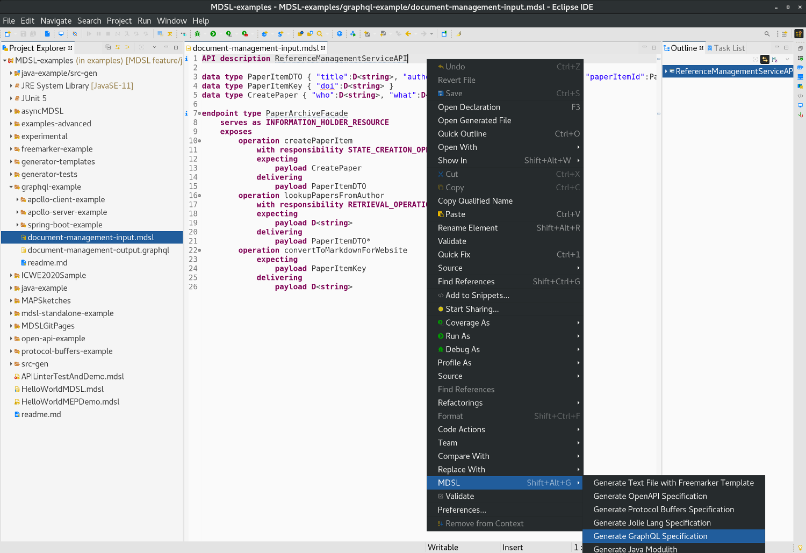

GraphQL Generator
=================
The MDSL Eclipse plugin and the CLI allow API designers to generate [GraphQL](https://graphql.org/) schema files out of MDSL. GraphQL is a query language for APIs. The generator creates one `*.graphql` file per MDSL endpoint. 

## Usage
You can generate the GraphQL file out of an MDSL model by using the MDSL [Eclipse plugin](./../tools#eclipse-plugin) or our [CLI](./../tools#command-line-interface-cli-tools).

In Eclipse, you find the generator in the MDSL context menu:

<a href="./../media/eclipse-graphql-generator-context-menu.png"></a>

If you work with the CLI, the following command generates the GraphQL specification:

```bash
./mdsl -i model.mdsl -g graphql
```

_Hint:_ Both tools generate the Graphql file into the `src-gen` folder which is located in the projects root directory (Eclipse) or the directory from which the `mdsl` command has been called (CLI). Both tools create the directory automatically in case it does not already exist.

## Example
The following MDSL model was outcome of this [blogpost](https://ozimmer.ch/practices/2020/06/10/ICWEKeynoteAndDemo.html):

```
API description ReferenceManagementServiceAPI

data type PaperItemDTO { "title":D<string>, "authors":D<string>, "venue":D<string>, "paperItemId":PaperItemKey }
data type PaperItemKey { "doi":D<string> }
data type CreatePaper { "who":D<string>, "what":D<string>, "where":D<string> }

endpoint type PaperArchiveFacade
  serves as INFORMATION_HOLDER_RESOURCE
  exposes
    operation createPaperItem
      with responsibility STATE_CREATION_OPERATION
      expecting
        payload CreatePaper
      delivering
        payload PaperItemDTO
    operation lookupPapersFromAuthor
      with responsibility RETRIEVAL_OPERATION
      expecting
        payload D<string>
      delivering
        payload PaperItemDTO*
    operation convertToMarkdownForWebsite
      expecting
        payload PaperItemKey
      delivering
        payload D<string>
```

The generator produces the following GraphQL schema for the single endpoint in the above MDSL specification:


## Generated GraphQL 

The GraphQL that is generated for the `PaperArchiveFacade` endpoint of the `ReferenceManagementServiceAPI` is this:

```
input PaperItemDTOInput {
	title: String!
	authors: String!
	venue: String!
	paperItemId: PaperItemKeyInput!
}
input PaperItemKeyInput {
	doi: String!
}
input CreatePaperInput {
	who: String!
	what: String!
	where: String!
}
input lookupPapersFromAuthorRequestDataTypeInput {
	anonymous1: String!
}
input PaperItemDTOListInput {
	entries: [PaperItemDTOInput!]!
}
input ConvertToMarkdownForWebsiteResponseDataTypeInput {
	anonymous2: String!
}
type PaperItemDTOOutput {
	title: String!
	authors: String!
	venue: String!
	paperItemId: PaperItemKeyOutput!
}
type PaperItemKeyOutput {
	doi: String!
}
type CreatePaperOutput {
	who: String!
	what: String!
	where: String!
}
type lookupPapersFromAuthorRequestDataTypeOutput {
	anonymous1: String!
}
type PaperItemDTOListOutput {
	entries: [PaperItemDTOOutput!]!
}
type ConvertToMarkdownForWebsiteResponseDataTypeOutput {
	anonymous2: String!
}

type Query {
	lookupPapersFromAuthor(
		anonymousInput: lookupPapersFromAuthorRequestDataTypeInput
	): PaperItemDTOListOutput
}

type Mutation {
	createPaperItem(
		anonymousInput: CreatePaperInput
	): PaperItemDTOOutput
	convertToMarkdownForWebsite(
		anonymousInput: PaperItemKeyInput
	): ConvertToMarkdownForWebsiteResponseDataTypeOutput
}

schema {
	query: Query
	mutation: Mutation
}

# additional scalars for types in MDSL
scalar Raw
scalar VoidResponse
```

You can find the sources for this example [here](https://github.com/socadk/MDSL/tree/master/examples/graphql-example).

**Note:** The GraphQL generator is an experimental prototype and implemented in a straightforward fashion. We generate an "input" and an "output" type for all MDSL types available; not all of these generated types might not be required. We also wrap lists into objects, which could often be simplified after generation.

**Note:** A GraphQL schema needs at least one query operation. The generator maps all MDSL operations with the responsibilities [_COMPUTATION_FUNCTION_](https://microservice-api-patterns.org/patterns/responsibility/operationResponsibilities/ComputationFunction) and [_RETRIEVAL_OPERATION_](https://microservice-api-patterns.org/patterns/responsibility/operationResponsibilities/RetrievalOperation) to queries; all other operations are mapped to mutations. Thus, please ensure that your MDSL endpoint contains at least one operation with one of the responsibilities above.

## Tools for Validation
To validate whether the generated `*.graphql` file is valid, you can use IDE plugins/extensions or web tools. For example:

 * [GraphQL extensions for VS Code](https://marketplace.visualstudio.com/items?itemName=GraphQL.vscode-graphql)
 * [graphqleditor.com](https://graphqleditor.com/)

The [graphqleditor.com](https://graphqleditor.com/) online tool provides an editor that compiles the schema and features a graphical representation of the model:

<a target="_blank" href="/media/graphqleditor.com-screenshot.png"></a>

In addition to that, the tool allows you to run a fake/mock backend that serves generated test data. For example, we can write and execute the following query that returns paper items for the example schema above:

```
query {
  lookupPapersFromAuthor(anonymousInput: {anonymous1: "Olaf Zimmermann"}) {
    entries {
      title
      authors
      venue
    }
  }
}
```

The tool generates corresponding test data:

<a target="_blank" href="/media/graphqleditor.com-faker-screenshot.png"></a>

**Note:** The parameter names _anonymousInput_ and _anonymous1_ are generated that way because the MDSL model does not provide names for these parameters. Better names  would be _lookupQueryInput_ and _author_ in this case. However, we cannot derive the correct names automatically; you can of course change these names in the generated `*.graphql` schema file.


## Implementing Server and Client Code
With the generated GraphQL schema, you can easily implement server and/or client apps.

### Apollo
[Apollo](https://www.apollographql.com) is a popular GraphQL implementation in JavaScript. In the following, we explain how you can create an Apollo server and client based on the generated GraphQL schema in just a few minutes.

#### Server
apollo-server lets you create a backend that responds to GraphQL queries. The following steps are based on this basic [Apollo tutorial](https://www.apollographql.com/docs/apollo-server/getting-started/).

First of all, you have to create and initialize a new Node.js project by executing the following steps on your terminal:

```bash
mkdir graphql-server-example
cd graphql-server-example
npm init --yes
npm install apollo-server graphql
```

After that, you create a `index.js` file implementing the server.

Copy the following basic file structure into your `index.js` file and replace «TODO 1: YOUR GRAPHQL SCHEMA» with the content of the generated *.graphql file:

```js
const { ApolloServer, gql } = require('apollo-server');

// A schema is a collection of type definitions (hence "typeDefs")
// that together define the "shape" of queries that are executed against
// your data.
const typeDefs = gql`
// TODO 1: YOUR GRAPHQL SCHEMA
`;

const resolvers = {
  Query: {
    // TODO 2: implement resolvers
  },
};

// The ApolloServer constructor requires two parameters: your schema
// definition and your set of resolvers.
const server = new ApolloServer({ typeDefs, resolvers });

// The `listen` method launches a web server.
server.listen().then(({ url }) => {
  console.log(`🚀  Server ready at ${url}`);
});

```

Finally, you just have to implement some resolvers that actually return some data. For our example above, we implemented the following resolver that answers the _lookupPapersFromAuthor_ query:

```js
const papers = {
  entries: [
    {
      title: 'Domain-driven Service Design - Context Modeling, Model Refactoring and Contract Generation',
      authors: 'Stefan Kapferer and Olaf Zimmermann',
      venue: 'OST'
    },
    {
      title: 'Dimensions of Successful Web API Design and Evolution: Context, Contracts, Components',
      authors: 'Olaf Zimmermann',
      venue: 'OST'
    },
  ]
};

const resolvers = {
  Query: {
    lookupPapersFromAuthor: () => papers,
  },
};
```

Find the complete server example [here](https://github.com/socadk/MDSL/tree/master/examples/graphql-example/apollo-server-example/index.js).

Once you created the `index.js` with the generated GraphQL schema and at least one resolver, you can start the server with the following command:

```bash
node index.js
```

If everything is fine you will get the following output and can open the mentioned URL in the browser:

```bash
🚀  Server ready at http://localhost:4000/
```

Vou can test your server by executing queries at that URL:

<a target="_blank" href="/media/apollo-server-test-screenshot.png"></a>

In a second step you can implement a mutation. Enhance the resolvers implementation as follows:

```js
const resolvers = {
  Query: {
    lookupPapersFromAuthor: () => papers,
  },
  Mutation: {
	createPaperItem: ( parent, { anonymousInput: { who, what, where }} ) => {
		const returnObj = {
			title: what,
			authors: who,
			venue: where,
			paperItemId: {
				doi: "Fake-DOI"
			}
		}
		return returnObj;
	}
  }
};
```

Now we are able to test the following mutation (_createPaperItem_):

```
mutation createPaper {
  createPaperItem(anonymousInput: {who: "Stefan Kapferer", what: "A Modeling Framework for Strategic Domain-driven Design", where: "HSR"}) {
    title
    authors
    venue
    paperItemId {
      doi
    }
  }
}
```

<a target="_blank" href="/media/apollo-server-test-mutation-screenshot.png"></a>

**Note:** The mutation implementation just returns a fake object and does not persist the new paper item. It can therefore not be queried after the insertion mutation has been executed.

#### Client
Based on [this tutorial](https://www.apollographql.com/docs/react/get-started/) we can now also create a simple React client that calls the query implemented above.

Just create a project and initialize it with the following commands:

```bash
mkdir graphql-client-example
cd graphql-client-example
npm init --yes
npm install apollo-client graphql react react-dom react-scripts
```

You have to create an `index.html` in the folder `public` as follows:

```html
<!DOCTYPE html>
<html lang="en">
  <head>
    <meta charset="utf-8" />
    <meta
      name="viewport"
      content="width=device-width, initial-scale=1, shrink-to-fit=no"
    />
    <meta name="theme-color" content="#000000" />
    <title>Apollo client example</title>
  </head>
  <body>
    <noscript>
      You need to enable JavaScript to run this app.
    </noscript>
    <div id="root"></div>
  </body>
</html>

```

... and an `index.js` file in the `src` folder. The following example calls our query and lists the paper items on the page:

```
import React from "react";
import { render } from "react-dom";
import {
  ApolloClient,
  InMemoryCache,
  ApolloProvider,
  useQuery,
  gql
} from "@apollo/client";

const client = new ApolloClient({
        uri: 'http://localhost:4000',
  cache: new InMemoryCache()
});

function PaperItems() {
  const { loading, error, data } = useQuery(gql`
    query {
      lookupPapersFromAuthor(anonymousInput: {anonymous1: "Olaf Zimmermann"}) {
        entries {
          title
          authors
          venue
        }
      }
    }`);

  if (loading) return <p>Loading...</p>;
  if (error) return <p>Error :(</p>;

  return data.lookupPapersFromAuthor.entries.map(({ title, authors, venue }) => (
    <div key={title}>
      <p>
          {authors}: {title} ({venue})
      </p>
    </div>
  ));
}

function App() {
  return (
    <ApolloProvider client={client}>
      <div>
        <h2>My first Apollo app 🚀</h2>
        <PaperItems />
      </div>
    </ApolloProvider>
  );
}

render(<App />, document.getElementById("root"));
```

**Note** that we used the URL `localhost:4000` to connect to our Apollo server started above.

When adding the following start scripts to your `package.json` file, you can start the client with `npm start`:

```json
  "scripts": {
    "start": "react-scripts start",
    "build": "react-scripts build",
    "test": "react-scripts test --env=jsdom",
    "eject": "react-scripts eject"
  }
```

You can now open the browser and `localhost:3000` will start the app and list our two papers returned by the Apollo server:

<a target="_blank" href="/media/apollo-client-test-screenshot.png"></a>

Find the complete client example [here](https://github.com/socadk/MDSL/tree/master/examples/graphql-example/apollo-client-example/).


### Generating Code for other GraphQL Implementations
There are other implementation of GraphQL for other programming languages, for example [Java](https://www.graphql-java.com/). You can find a list of many supported languages [here](https://graphql.org/code/).

In case you want to use your GraphQL schema to generate client and/or server code, we recommend to have a look at the [GraphQL Code Generator](https://graphql-code-generator.com). It allows you to generate code for many languages; also for Apollo.

An easy way to get an impression of how the code generator works is by using the live demo ([https://graphql-code-generator.com/#live-demo](https://graphql-code-generator.com/#live-demo)). In the following screenshot you can see that we generated Java code by pasting our Schema into the live demo of the code generator:

<a target="_blank" href="/media/code-generator-live-demo.png"></a>

We created an example Java (Spring Boot) application that uses the code generator. You find the complete example project [here](https://github.com/socadk/MDSL/tree/master/examples/graphql-example/spring-boot-example/).

#### Create Spring Boot (Java) Application
First, we created a classic Spring Boot project with [Spring initializr](https://start.spring.io/) (Gradle project).

In order to use the code generator, you have to add the following Gradle plugin... 

```gradle
id "com.moowork.node" version "1.3.1"
```

... and the following dependencies for GraphQL with Java:

```gradle
implementation 'com.graphql-java:graphql-java:15.0'
implementation 'com.graphql-java:graphql-java-spring-boot-starter-webmvc:2.0'
```

Also add Guava, as it will simplify the implementation of the data fetchers returning fake data:

```gradle
implementation 'com.google.guava:guava:26.0-jre'
```

With the following line in the `build.gradle` file, we ensure that the code generator is always called:

```gradle
build.dependsOn yarn
```

Then, we have to create a `package.json` file for calling the generator via yarn:

```json
{
  "name": "java-app",
  "scripts": {
    "postinstall": "graphql-codegen"
  },
  "dependencies": {
    "graphql": "^15.3.0",
    "@graphql-codegen/cli": "1.17.10",
    "@graphql-codegen/java": "1.17.8",
    "@graphql-codegen/java-resolvers": "1.17.8"
  }
}
```

In addition, we have to create a `codegen.yml` file to configure the code generator:

```yml
schema: src/main/resources/schema.graphql
generates:
  src/main/java/io/mdsl/graphql/javaexampleapp/generated/Types.java:
    plugins:
      - java
  src/main/java/io/mdsl/graphql/javaexampleapp/generated/Resolvers.java:
    plugins:
      - java-resolvers
```

As you can see, we expect the GraphQL schema under `src/main/resources/schema.graphql`. We copied our example schema from the top of this page into the corresponding folder.

Now we can call `./gradlew yarn` to call the generator for the first time. From this time on, `./gradlew clean build` will always generate the sources into the `io.mdsl.graphql.javaexampleapp.generated` package.

Based on the generated types we implemented one of the resolver interfaces. Again, the _lookupPapersFromAuthor_ operation: 

```java
@Component
public class GraphQLDataFetchers implements Resolvers.Query {

    private static List<Map<String, String>> papers = Arrays.asList(
            ImmutableMap.of(
                    "title", "Domain-driven Service Design - Context Modeling, Model Refactoring and Contract Generation",
                    "authors", "Stefan Kapferer and Olaf Zimmermann",
                    "venue", "OST"),
            ImmutableMap.of(
                    "title", "Dimensions of Successful Web API Design and Evolution: Context, Contracts, Components",
                    "authors", "Olaf Zimmermann",
                    "venue", "OST")
    );

    @Override
    public DataFetcher<Object> lookupPapersFromAuthor() {
        return dataFetchingEnvironment -> {
            Types.QueryLookupPapersFromAuthorArgs input = new Types.QueryLookupPapersFromAuthorArgs(dataFetchingEnvironment.getArguments());
            String author = input.getAnonymousInput().getAnonymous1();
            return ImmutableMap.of("entries", papers
                    .stream()
                    .filter(paper -> paper.get("authors").contains(author))
                    .collect(Collectors.toList()));
        };
    }
}
```

Finally, we have to implement a `GraphQLProvider` that wires our data fetcher:

```java
@Component
public class GraphQLProvider {

    @Autowired
    GraphQLDataFetchers graphQLDataFetchers;

    private GraphQL graphQL;

    @PostConstruct
    public void init() throws IOException {
        URL url = Resources.getResource("schema.graphql");
        String sdl = Resources.toString(url, Charsets.UTF_8);
        GraphQLSchema graphQLSchema = buildSchema(sdl);
        this.graphQL = GraphQL.newGraphQL(graphQLSchema).build();
    }

    private GraphQLSchema buildSchema(String sdl) {
        TypeDefinitionRegistry typeRegistry = new SchemaParser().parse(sdl);
        RuntimeWiring runtimeWiring = buildWiring();
        SchemaGenerator schemaGenerator = new SchemaGenerator();
        return schemaGenerator.makeExecutableSchema(typeRegistry, runtimeWiring);
    }

    private RuntimeWiring buildWiring() {
        return RuntimeWiring.newRuntimeWiring()
                .scalar(CustomScalars.VOID)
                .scalar(CustomScalars.RAW)
                .type(newTypeWiring("Query")
                        .dataFetcher("lookupPapersFromAuthor", graphQLDataFetchers.lookupPapersFromAuthor()))
                .build();
    }

    @Bean
    public GraphQL graphQL() {
        return graphQL;
    }

}
```

**Note** that we had to provide implementations for our custom scalars (_Void_ and _Raw_). You find it in our [example project](https://github.com/socadk/MDSL/tree/master/examples/graphql-example/spring-boot-example/).

The Spring Boot application can now be started with `./gradlew clean bootRun` (please adopt the command invocation to your OS). As soon as the application is started, you can run the same query as we did before with Apollo. The following screenshot shows our test with Postman:

<a target="_blank" href="/media/spring-boot-test-with-postman.png"></a>

That's it. This was a short introduction what you can do with the GraphQL schema's generated by the MDSL tool. Try it out with your own MDSL model, or let [Context Mapper](https://contextmapper.org/docs/mdsl/) generate one for your from your Domain-Driven Design [bounded contexts](https://contextmapper.org/docs/bounded-context/)!


# Other Generators

Also checkout our other generators:

* [Open API generator](./open-api)
* [Protocol Buffers generator](./protocol-buffers)
* [Jolie generator](./jolie)
* [Java generator](./java)
* [Arbitrary textual generation with Freemarker](./freemarker)

# Site Navigation

* Back to [tools page](./../tools).
* [Quick reference](./../quickreference) and [tutorial](./../tutorial). 
* Language specification: 
    * Service [endpoint contract types](./../servicecontract) and [data contracts (schemas)](./../datacontract). 
    * [Bindings](./../bindings) and [instance-level concepts](./../optionalparts). 
* Back to [MDSL homepage](./../index).

*Copyright: Stefan Kapferer and Olaf Zimmermann, 2020. All rights reserved. See [license information](https://github.com/socadk/MDSL/blob/master/LICENSE).*

<!-- *EOF* -->