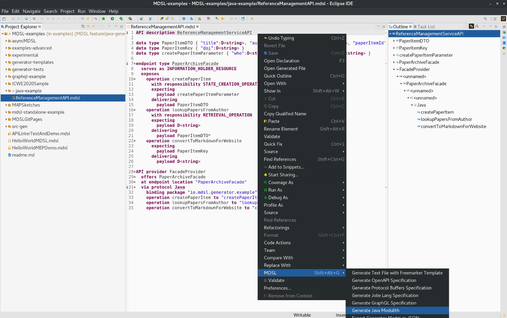
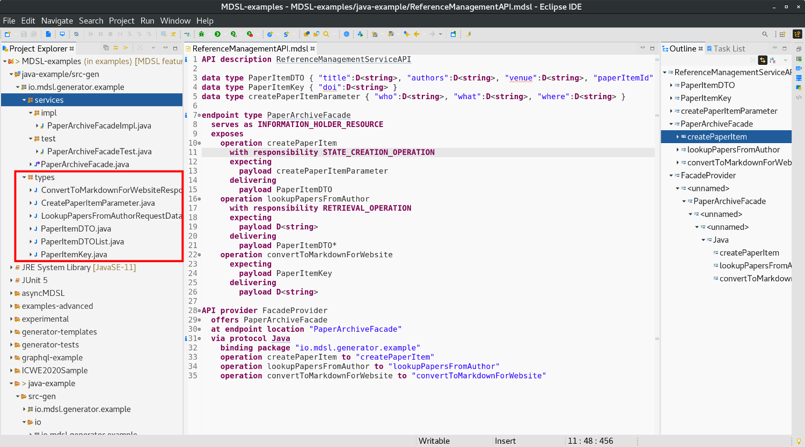
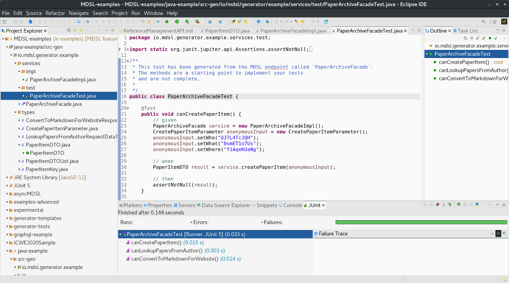

Java Generator
==============
The MDSL Eclipse plugin and the CLI allow API designers to generate Java code out of MDSL. The code can then be used to implement modular monoliths ("moduliths"), (micro-)services, or any other decomposition style (as long as you use Java for its implementation). If a modular monolith approach is chosen, the [Spring Boot extension "Moduliths"](https://github.com/odrotbohm/moduliths](https://github.com/odrotbohm/moduliths) can be used to verify the modular structure, to bootstrap a subset of the modules and to derive PlantUML documentation about the modules.

## Usage
You can generate Java code out of an MDSL model by using the MDSL [Eclipse plugin](./../tools#eclipse-plugin) or our [CLI](./../tools#command-line-interface-cli-tools).

In Eclipse, you find the generator in the MDSL context menu:

<a href="./../media/eclipse-java-generator-context-menu.png"></a>

If you work with the CLI, the following command generates the Java code:

```bash
./mdsl -i model.mdsl -g java
```

_Hint:_ Both tools generate the Java sources into the `src-gen` folder which is located in the projects root directory (Eclipse) or the directory from which the `mdsl` command has been called (CLI). Both tools create the directory automatically in case it does not already exist.

## Generator Output
The generator creates the following Java classes:

 * A [Plain Old Java Object (POJO)](https://de.wikipedia.org/wiki/Plain_Old_Java_Object) for each data type of the contract.
 * An interface for each endpoint.
 * An exemplary implementation for each interface.
 * An exemplary [JUnit 5](https://junit.org/junit5/) test for each interface implementation.

Note that the the implementations and unit tests provide an initial structure only. They are not complete; for instance, they work with some randomly generated test data. The generated code contains TODO comments in the places where the implementation would continue.


## Example
The following example illustrates what the generator produces for an exemplary MDSL contract.

You find the complete sources (incl. generated Java code) of this example [here](https://github.com/Microservice-API-Patterns/MDSL-Specification/tree/master/examples/java-example).

We use the following MDSL model which was an outcome of this [blogpost](https://ozimmer.ch/practices/2020/06/10/ICWEKeynoteAndDemo.html) to illustrate our generator outputs:

```
API description ReferenceManagementServiceAPI

data type PaperItemDTO { "title":D<string>, "authors":D<string>, "venue":D<string>, "paperItemId":PaperItemKey }
data type PaperItemKey { "doi":D<string> }
data type createPaperItemParameter { "who":D<string>, "what":D<string>, "where":D<string> }

endpoint type PaperArchiveFacade
  serves as INFORMATION_HOLDER_RESOURCE
  exposes
    operation createPaperItem
      with responsibility STATE_CREATION_OPERATION
      expecting
        payload createPaperItemParameter
      delivering
        payload PaperItemDTO
    operation lookupPapersFromAuthor
      with responsibility RETRIEVAL_OPERATION
      expecting
        payload D<string>
      delivering
        payload PaperItemDTO*
    operation convertToMarkdownForWebsite
      expecting
        payload PaperItemKey
      delivering
        payload D<string>
        
API provider FacadeProvider
  offers PaperArchiveFacade
  at endpoint location "PaperArchiveFacade"
  via protocol Java
    binding package "io.mdsl.generator.example"
    operation createPaperItem to "createPaperItem"
    operation lookupPapersFromAuthor to "lookupPapersFromAuthor"
    operation convertToMarkdownForWebsite to "convertToMarkdownForWebsite"
```

_Note:_ The `API provider` element at the bottom of this sample contract is optional. With its Java binding it allows you to define the base Java package name and the used method names. The generator will use default values in case you do not provide such a Java binding.

The generator will create a `types` subpackage that will contain all the data types from your MDSL contract:

<a href="./../media/java-generator-types-package-screenshot.png"></a>

The following example show how data type classes look like. These POJOs are local [Data Transfer Objects](https://martinfowler.com/bliki/LocalDTO.html) with attributes, "getters", and "setters":

```java
package io.mdsl.generator.example.types;


/**
 * This class has been generated from the MDSL data type 'PaperItemDTO'. 
 * 
 */
public class PaperItemDTO {

  private String title; 
  private String authors; 
  private String venue; 
  private PaperItemKey paperItemId; 
  
  public String getTitle() {
    return title;
  }
  
  public void setTitle(String title) {
    this.title = title;
  }
  
  public String getAuthors() {
    return authors;
  }
  
  public void setAuthors(String authors) {
    this.authors = authors;
  }
  
  public String getVenue() {
    return venue;
  }
  
  public void setVenue(String venue) {
    this.venue = venue;
  }
  
  public PaperItemKey getPaperItemId() {
    return paperItemId;
  }
  
  public void setPaperItemId(PaperItemKey paperItemId) {
    this.paperItemId = paperItemId;
  }
  
}
```

In addition to the data type classes, the generator creates a Java interface in the `services` subpackage:

```java
package io.mdsl.generator.example.services;

import io.mdsl.generator.example.types.*;

/**
 * This interface has been generated from the MDSL endpoint called 'PaperArchiveFacade'. 
 * 
 */
public interface PaperArchiveFacade {

  /**
   * MAP decorator: STATE_CREATION_OPERATION
   * 
   * Find all MAP responsibility patterns here: https://microservice-api-patterns.org/patterns/responsibility/
   */
  PaperItemDTO createPaperItem(CreatePaperItemParameter anonymousInput);
  
  /**
   * MAP decorator: RETRIEVAL_OPERATION
   * 
   * Find all MAP responsibility patterns here: https://microservice-api-patterns.org/patterns/responsibility/
   */
  PaperItemDTOList lookupPapersFromAuthor(LookupPapersFromAuthorRequestDataType anonymousInput);
  
  ConvertToMarkdownForWebsiteResponseDataType convertToMarkdownForWebsite(PaperItemKey anonymousInput);
  
}
```

The `services.impl` subpackage contains an implementation of each interface (executable but certainly not complete; you will have to provide the final implementation):

```java
package io.mdsl.generator.example.services.impl;

import io.mdsl.generator.example.services.PaperArchiveFacade;
import io.mdsl.generator.example.types.*;
import java.util.Arrays;

/**
 * This implementation has been generated from the MDSL endpoint called 'PaperArchiveFacade'.
 * The methods are a starting point to realize the logic behind an endpoint
 * and are not complete. 
 * 
 */
public class PaperArchiveFacadeImpl implements PaperArchiveFacade {

  /**
   * MAP decorator: STATE_CREATION_OPERATION
   * 
   * Find all MAP responsibility patterns here: https://microservice-api-patterns.org/patterns/responsibility/
   */
  public PaperItemDTO createPaperItem(CreatePaperItemParameter anonymousInput) {
    System.out.println("The received object for parameter 'anonymousInput' is " + (anonymousInput == null ? "null." : "not null."));
    // TODO: we just return a dummy object here; replace this with your implementation
    PaperItemDTO obj = new PaperItemDTO();
    obj.setTitle("8KmDBMtnbr");
    obj.setAuthors("VwMgP7Y5Hl");
    obj.setVenue("VBGae4PUuB");
    return obj;
  }
  
  /**
   * MAP decorator: RETRIEVAL_OPERATION
   * 
   * Find all MAP responsibility patterns here: https://microservice-api-patterns.org/patterns/responsibility/
   */
  public PaperItemDTOList lookupPapersFromAuthor(LookupPapersFromAuthorRequestDataType anonymousInput) {
    System.out.println("The received object for parameter 'anonymousInput' is " + (anonymousInput == null ? "null." : "not null."));
    // TODO: we just return a dummy object here; replace this with your implementation
    PaperItemDTOList obj = new PaperItemDTOList();
    return obj;
  }
  
  public ConvertToMarkdownForWebsiteResponseDataType convertToMarkdownForWebsite(PaperItemKey anonymousInput) {
    System.out.println("The received object for parameter 'anonymousInput' is " + (anonymousInput == null ? "null." : "not null."));
    // TODO: we just return a dummy object here; replace this with your implementation
    ConvertToMarkdownForWebsiteResponseDataType obj = new ConvertToMarkdownForWebsiteResponseDataType();
    obj.setAnonymous2("P2qGt44VJE");
    return obj;
  }
  
}
```

As you can see in the example above, randomly generated test data is created and returned. The implementation classes are only a starting point; the TODO comments indicate where the real implementations would continue.

Finally, we generate an initial structure for a [JUnit 5](https://junit.org/junit5/) test into the `services.test` subpackage:

```java
package io.mdsl.generator.example.services.test;

import static org.junit.jupiter.api.Assertions.assertNotNull;

import org.junit.jupiter.api.Test;
import java.util.Arrays;

import io.mdsl.generator.example.services.PaperArchiveFacade;
import io.mdsl.generator.example.services.impl.PaperArchiveFacadeImpl;
import io.mdsl.generator.example.types.*;

/**
 * This test has been generated from the MDSL endpoint called 'PaperArchiveFacade'.
 * The methods are a starting point to implement your tests
 * and are not complete. 
 * 
 */
public class PaperArchiveFacadeTest {

  @Test
  public void canCreatePaperItem() {
    // given
    PaperArchiveFacade service = new PaperArchiveFacadeImpl();
    CreatePaperItemParameter anonymousInput = new CreatePaperItemParameter();
    anonymousInput.setWho("UJ7L4TcJQH");
    anonymousInput.setWhat("0smET1o7Us");
    anonymousInput.setWhere("f1AqeKUaNg");
    
    // when
    PaperItemDTO result = service.createPaperItem(anonymousInput);
    
    // then
    assertNotNull(result);
  }
  
  @Test
  public void canLookupPapersFromAuthor() {
    // given
    PaperArchiveFacade service = new PaperArchiveFacadeImpl();
    LookupPapersFromAuthorRequestDataType anonymousInput = new LookupPapersFromAuthorRequestDataType();
    anonymousInput.setAnonymous1("5hbpNILyJe");
    
    // when
    PaperItemDTOList result = service.lookupPapersFromAuthor(anonymousInput);
    
    // then
    assertNotNull(result);
  }
  
  @Test
  public void canConvertToMarkdownForWebsite() {
    // given
    PaperArchiveFacade service = new PaperArchiveFacadeImpl();
    PaperItemKey anonymousInput = new PaperItemKey();
    anonymousInput.setDoi("1rsV2rzIAe");
    
    // when
    ConvertToMarkdownForWebsiteResponseDataType result = service.convertToMarkdownForWebsite(anonymousInput);
    
    // then
    assertNotNull(result);
  }
  
}
```

The tests only also provide an initial structure only. They work with generated test data and only assert that the interface methods return an object that is not null. After the generation, you may want to complete those tests with semantically meaningful code and assertions.

However, you can already compile the Java code and run the generated unit tests directly after calling the Java generator:

<a href="./../media/java-generator-running-unit-tests-screenshot.png"></a>

You find the complete sources (incl. generated Java code) of this example [here](https://github.com/Microservice-API-Patterns/MDSL-Specification/tree/master/examples/java-example).


## Hints and Tips

* MDSL allows specifying data types and attributes without providing type or attribute names. This is why generated type or attribute names may start with `Anonymous...` or `anonymous...`. You can fix this by renaming the types and/or fields after the generation (Java rename refactoring), or by providing names in your MDSL contract (and re-generate).
* Have a look at messages from the API Linter (described on the [tools page](./../tools)) and make sure that a MDSL specification validates before calling any generator.


## Known Limitations

* The endpoint location name from the API provider part of the MDSL specification is ignored.
* The operations bindings have to be present if a binding is present, but are not used. 
* Error and security information is not used by the Java modulith generator either.


# Other Generators
Also checkout our other generators:

* [Open API generator](./open-api)
* [Protocol Buffers generator](./protocol-buffers)
* [GraphQL generator](./graphql)
* [Jolie generator](./jolie)
* [Arbitrary textual generation with Freemarker](./freemarker)


# Site Navigation

* Back to [tools page](./../tools).
* [Quick reference](./../quickreference) and [tutorial](./../tutorial). 
* Language specification: 
    * Service [endpoint contract types](./../servicecontract) and [data contracts (schemas)](./../datacontract). 
    * [Bindings](./../bindings) and [instance-level concepts](./../optionalparts). 
* Back to [MDSL homepage](./../index).

*Copyright: Stefan Kapferer and Olaf Zimmermann, 2020. All rights reserved. See [license information](https://github.com/Microservice-API-Patterns/MDSL-Specification/blob/master/LICENSE).*
