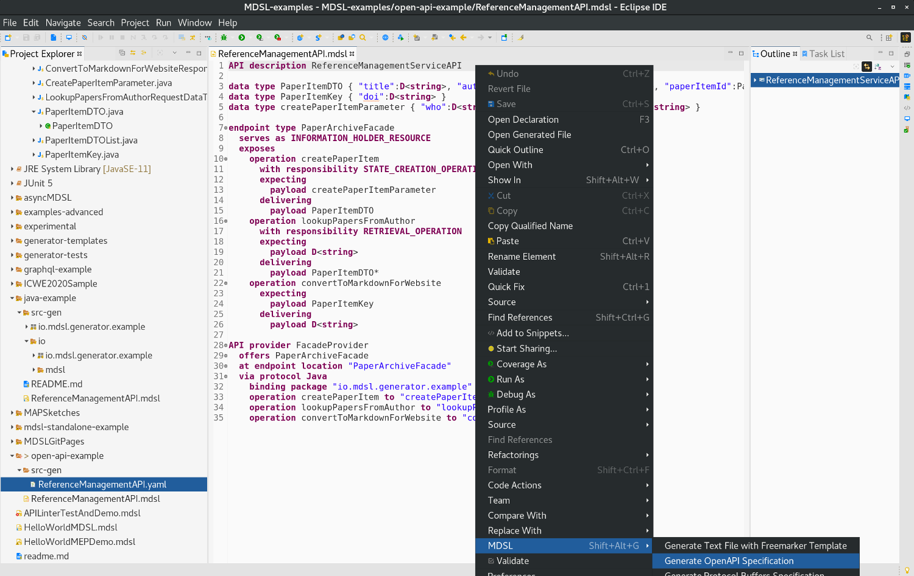

Open API Specification Generator
================================

The MDSL Eclipse plugin and the CLI allow API designers to generate [Open API specifications](https://www.openapis.org/) out of MDSL. 

## Usage
You can generate the specifications out of an MDSL model by using the [Eclipse plugin](./../tools#eclipse-plugin) or our [CLI](./../tools#command-line-interface-cli-tools).

In Eclipse you find the generator in the MDSL context menu:

<a href="./../media/eclipse-oas-generator-context-menu.png"></a>

The following command generates a specification in case you work with the CLI:

```bash
./mdsl -i model.mdsl -g oas
```

_Hint:_ Both tools generate the output into the `src-gen` folder which is located in the projects root directory (Eclipse) or the directory from which the `mdsl` command has been called (CLI). Both tools create the directory automatically in case it does not already exist.

## Generator Output / Mapping
The OpenAPI specification generator maps endpoint types to HTTP resource paths, and operations to HTTP methods/verbs like this:

* If a MAP decorator is used, it is mapped as this:
    * `STATE_CREATION_OPERATION` is transformed to `PUT` (yes, `POST` also would make sense)
    * `RETRIEVAL_OPERATION` is transformed to `GET` (which causes problems if the request message has a complex structure)
    * `STATE_TRANSITION_OPERATION` is transformed to `PATCH`
    * `COMPUTATION_FUNCTION` is transformed to `POST`
* If an HTTP verb is used instead of a MAP decorator (`"GET"`, `"POST"` etc.), it is passed through 
* If the operation name suggests CRUDish semantics (or starts with HTTP verb names), it is mapped as this: 
    * createX is transformed into `POST` 
    * readX and getX are transformed into `GET`
    * putX is transformed into `PUT` 
    * updateX and patchX are transformed into `PATCH`
    * deleteX is transformed into `DELETE`

If an HTTP verb appears more than once in a resource endpoint, nothing will be generated on the endpoint type level. An HTTP [binding](./bindings#http-protocol-binding) has to be defined then; at present one and only one such binding should be present; the generator will use the first one it finds. Note that not all abstract contracts can be mapped to all HTTP verbs; `GET`, in particular expects the in parameters to be simple enough so that they can be mapped to path and query parameters (this holds for atomic parameters and flat, unnested parameter trees).

See [this demo](https://ozimmer.ch/practices/2020/06/10/ICWEKeynoteAndDemo.html) as well.

## Example
The following example illustrates what the generator produces for an exemplary MDSL contract.

You find the complete sources (incl. the generated OAS specification) of this example [here](https://github.com/Microservice-API-Patterns/MDSL-Specification/tree/master/examples/open-api-example).

We use the following MDSL model which was an outcome of this [blogpost](https://ozimmer.ch/practices/2020/06/10/ICWEKeynoteAndDemo.html) to illustrate our generator outputs:

```
API description ReferenceManagementServiceAPI

data type PaperItemDTO { "title":D<string>, "authors":D<string>, "venue":D<string>, "paperItemId":PaperItemKey }
data type PaperItemKey { "doi":D<string> }
data type createPaperItemParameter { "who":D<string>, "what":D<string>, "where":D<string> }

endpoint type PaperArchiveFacade
  serves as INFORMATION_HOLDER_RESOURCE
  exposes
    operation createPaperItem
      with responsibility STATE_CREATION_OPERATION
      expecting
        payload createPaperItemParameter
      delivering
        payload PaperItemDTO
    operation lookupPapersFromAuthor
      with responsibility RETRIEVAL_OPERATION
      expecting
        payload D<string>
      delivering
        payload PaperItemDTO*
    operation convertToMarkdownForWebsite
      expecting
        payload PaperItemKey
      delivering
        payload D<string>
```

For the MDSL contract above, the generator produces the following OAS specification:

```yaml
openapi: 3.0.1
info:
  title: ReferenceManagementServiceAPI
  version: "1.0"
tags:
- name: PaperArchiveFacade
  description: general data-oriented endpoint
  externalDocs:
    description: INFORMATION_HOLDER_RESOURCE
    url: https://microservice-api-patterns.org/patterns/responsibility/
paths:
  /PaperArchiveFacade:
    summary: general data-oriented endpoint
    description: 'MAP link: INFORMATION_HOLDER_RESOURCE available at [the MAP website](https://microservice-api-patterns.org/)'
    get:
      tags:
      - PaperArchiveFacade
      summary: read only
      description: This operation realizes the Retrieval Operation pattern, described
        [on the MAP website](https://microservice-api-patterns.org/patterns/responsibility/operationResponsibilities/RetrievalOperation.html).
      operationId: lookupPapersFromAuthor
      parameters:
      - name: Parameter1
        in: query
        description: unspecified
        required: true
        schema:
          type: string
      responses:
        "200":
          description: response message payload (success case)
          content:
            application/json:
              schema:
                type: array
                items:
                  $ref: '#/components/schemas/PaperItemDTO'
    put:
      tags:
      - PaperArchiveFacade
      summary: write only
      description: This operation realizes the State Creation Operation pattern, described
        [on the MAP website](https://microservice-api-patterns.org/patterns/responsibility/operationResponsibilities/StateCreationOperation.html).
      operationId: createPaperItem
      requestBody:
        content:
          application/json:
            schema:
              $ref: '#/components/schemas/createPaperItemParameter'
      responses:
        "200":
          description: response message payload (success case)
          content:
            application/json:
              schema:
                $ref: '#/components/schemas/PaperItemDTO'
    post:
      tags:
      - PaperArchiveFacade
      description: unspecified operation responsibility
      operationId: convertToMarkdownForWebsite
      requestBody:
        content:
          application/json:
            schema:
              $ref: '#/components/schemas/PaperItemKey'
      responses:
        "200":
          description: response message payload (success case)
          content:
            application/json:
              schema:
                type: object
                properties:
                  anonymous1:
                    type: string
components:
  schemas:
    PaperItemDTO:
      type: object
      properties:
        title:
          type: string
        authors:
          type: string
        venue:
          type: string
        paperItemId:
          $ref: '#/components/schemas/PaperItemKey'
    PaperItemKey:
      type: object
      properties:
        doi:
          type: string
    createPaperItemParameter:
      type: object
      properties:
        who:
          type: string
        what:
          type: string
        where:
          type: string
```

You find the complete sources (incl. the generated OAS specification) of this example [here](https://github.com/Microservice-API-Patterns/MDSL-Specification/tree/master/examples/open-api-example).


## Editor and Validation
You can use the [Swagger Editor](https://editor.swagger.io/) to validate generated OAS specifications and/or generate an HTML documentation. You can also generate client and server code from there.


## Known Limitations

* The endpoint location name from the API provider part of the MDSL specification is not yet added to the generated OpenAPI contract.
* The parameter mappings (MDSL to path, query, body/form parameters) do not cover all edge cases yet. For instance, the MDSL cardinalities of an expected payload (for example `*` for a list) are not used if the payload is mapped to parameters of HTTP GET or DELETE methods.
* Error reports must have a numeric identifier and be atomic parameters.
* The generator cannot deal with more than one binding, but uses the first one it finds.
* The HTTP binding information is not validated much; for instance, it is not checked that bound operations actually are exposed in the endpoint type.
 

# Other Generators

Also checkout our other generators:
* [Protocol Buffers generator](./protocol-buffers)
* [GraphQL generator](./graphql)
* [Jolie generator](./jolie)
* [Java generator](./java)
* [Arbitrary textual generation with Freemarker](./freemarker)


# Site Navigation

* Back to [tools page](./../tools).
* [Quick reference](./../quickreference) and [tutorial](./../tutorial). 
* Language specification: 
    * Service [endpoint contract types](./../servicecontract) and [data contracts (schemas)](./../datacontract). 
    * [Bindings](./../bindings) and [instance-level concepts](./../optionalparts). 
* Back to [MDSL homepage](./../index).

*Copyright: Stefan Kapferer and Olaf Zimmermann, 2020. All rights reserved. See [license information](https://github.com/socadk/MDSL/blob/master/LICENSE).*
