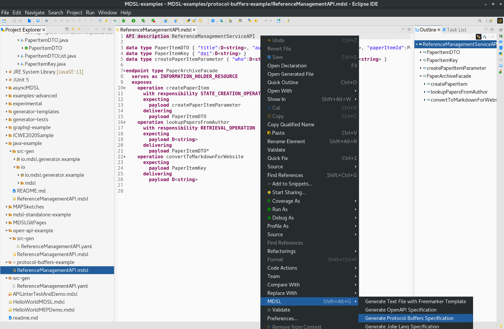

[Tools Overview](./../tools), [OpenAPI](./open-api), [GraphQL](./graphql), [Jolie](./jolie), [Java](./java), [Freemarker templating](./freemarker), [AsyncAPI](./async-api)

Protocol Buffers Generator
==========================

The MDSL Eclipse plugin and the CLI allow API designers to generate [Protocol Buffer specifications](https://developers.google.com/protocol-buffers/) out of MDSL. 

## Usage
You can generate the specifications out of an MDSL model by using the [Eclipse plugin](./../tools#eclipse-plugin) or our [CLI](./../tools#command-line-interface-cli-tools).

In Eclipse, the generator is available in the MDSL context menu:

<a href="./../media/eclipse-protocol-buffers-generator-context-menu.png"></a>

The following command generates a specification in case you work with the CLI:

```bash
mdsl -i model.mdsl -g proto
```

_Hint:_ Both plugin and CLI generate the output into the `src-gen` folder that is located in the project root directory (Eclipse plugin) or the directory from which the `mdsl` command has been called (CLI). The folder is created automatically if it does not exist yet.

## Generator Output / Mapping
The generator maps the MDSL concepts to `*.proto` files as follows:

 * One message for each MDSL data type.
 * One service for each MDSL endpoint.
 * One RPC call inside the service for each endpoint operation.

## Example
The following example illustrates what the generator produces for an exemplary MDSL contract.

We use the following MDSL model, created in this [tools demo](https://ozimmer.ch/practices/2020/06/10/ICWEKeynoteAndDemo.html), to illustrate our generator outputs:

```
API description ReferenceManagementServiceAPI

data type PaperItemDTO { "title":D<string>, "authors":D<string>, "venue":D<string>, "paperItemId":PaperItemKey }
data type PaperItemKey { "doi":D<string> }
data type createPaperItemParameter { "who":D<string>, "what":D<string>, "where":D<string> }

endpoint type PaperArchiveFacade
  serves as INFORMATION_HOLDER_RESOURCE
  exposes
    operation createPaperItem
      with responsibility STATE_CREATION_OPERATION
      expecting
        payload createPaperItemParameter
      delivering
        payload PaperItemDTO
    operation lookupPapersFromAuthor
      with responsibility RETRIEVAL_OPERATION
      expecting
        payload D<string>
      delivering
        payload PaperItemDTO*
    operation convertToMarkdownForWebsite
      expecting
        payload PaperItemKey
      delivering
        payload D<string>
```

For the MDSL contract above the generator produces the following `*.proto` file:

```proto
syntax = "proto3";

package ReferenceManagementServiceAPI;

message PaperItemDTO {
  string title = 1;
  string authors = 2;
  string venue = 3;
  PaperItemKey paperItemId = 4;
}

message PaperItemKey {
  string doi = 1;
}

message createPaperItemParameter {
  string who = 1;
  string what = 2;
  string where = 3;
}

message lookupPapersFromAuthorRequestMessage {
  string anonymous1 = 1;
}

message PaperItemDTOList {
  repeated PaperItemDTO entries = 1;
}

message ConvertToMarkdownForWebsiteResponseMessage {
  string anonymous2 = 1;
}

service PaperArchiveFacade {
  rpc lookupPapersFromAuthor(lookupPapersFromAuthorRequestMessage) returns (PaperItemDTOList);
  rpc createPaperItem(createPaperItemParameter) returns (PaperItemDTO);
  rpc convertToMarkdownForWebsite(PaperItemKey) returns (ConvertToMarkdownForWebsiteResponseMessage);
}
```

You find the complete sources (incl. generated `*.proto` file) of this example [here](https://github.com/Microservice-API-Patterns/MDSL-Specification/tree/master/examples/protocol-buffers-example).

You can use the generated `*.proto` files to implement a [gRPC](https://grpc.io/) interface.

<!-- 
Standalone protoc usage: 

* Get executable via via https://developers.google.com/protocol-buffers/docs/downloads#release-packages and unzip (or use other documented installation option)
* Run `protoc --java_out . [mdsloutput].proto`
* Add grpc and com.google.protobuf to project dependencies
-->

## Java Client/Server Sample
We explain how you can start implementing server and client code in Java with the following steps.

First, setup your project. We use Gradle as our build tool. In the build.gradle file we have to add the following dependencies:

```gradle
implementation 'io.grpc:grpc-netty-shaded:1.33.1'
implementation 'io.grpc:grpc-protobuf:1.33.1'
implementation 'io.grpc:grpc-stub:1.33.1'
compileOnly 'org.apache.tomcat:annotations-api:6.0.53' // necessary for Java 9+
```

In addition, since we want to generate code from `*.proto` files, we have to add _protobuf-gradle-plugin_ as follows:

```gradle
plugins {
    id 'com.google.protobuf' version '0.8.14'
}

protobuf {
  protoc {
    artifact = "com.google.protobuf:protoc:3.12.0"
  }
  plugins {
    grpc {
      artifact = 'io.grpc:protoc-gen-grpc-java:1.33.1'
    }
  }
  generateProtoTasks {
    all()*.plugins {
      grpc {}
    }
  }
}
```

Now we are ready to integrate our `*.proto` file into the project. Copy the file that we  generated above to the `src/main/proto` directory.

Once we copied the `*.proto` file, we can run `gradlew clean build`. The sources will be generated into `build/generated/source/proto/main/grpc` and `build/generated/source/proto/main/java`. To let your IDE know that the generated source are there, you have to adjust the `build.gradle` file a bit. Just add the following code block:

```gradle
sourceSets {
    main {
        java {
            srcDirs 'build/generated/source/proto/main/grpc'
            srcDirs 'build/generated/source/proto/main/java'
        }
    }
}
```

Let's start by implementing a server. Note that this code is based on the various gRPC examples that can be found [here](https://github.com/grpc/grpc-java/tree/master/examples). 

We create a new class called `ReferenceManagementServer`. In the generated code you will find a class with the name `*Grpc` that has a subclass `*ImplBase` for each of your services defined in the `*.proto` file. In our case it is `PaperArchiveFacadeGrpc.PaperArchiveFacadeImplBase`. We want to implement the method `createPaperItem` now. For that, we just add a static subclass that overrides this `*.ImplBase` and the corresponding method:

```java
public class ReferenceManagementServer {

    static class PaperFacade extends PaperArchiveFacadeGrpc.PaperArchiveFacadeImplBase {
        @Override
        public void createPaperItem(ReferenceManagementAPI.createPaperItemParameter request, StreamObserver<ReferenceManagementAPI.PaperItemDTO> responseObserver) {
            // TODO implement method
        }
    }
}
```

The generated `*.proto` file above specifies that this RPC shall respond with a `PaperItemDTO`. A simple implementation, sufficient for this tutorial, merely constructs such an object and returns it:

```java
public class ReferenceManagementServer {

    static class PaperFacade extends PaperArchiveFacadeGrpc.PaperArchiveFacadeImplBase {
        @Override
        public void createPaperItem(ReferenceManagementAPI.createPaperItemParameter request, StreamObserver<ReferenceManagementAPI.PaperItemDTO> responseObserver) {
            PaperItemDTO paperItemDTO = PaperItemDTO.newBuilder()
                    .setTitle(request.getWhat())
                    .setAuthors(request.getWho())
                    .setVenue(request.getWhere())
                    .build();
            responseObserver.onNext(paperItemDTO);
            responseObserver.onCompleted();
        }
    }
}
```

We fill the _title_, _authors_ and _venue_ attributes of the object with the values we receive from the request object.

In addition to that we need some code to start and stop the server (you can also find this in the [gRPC samples](https://github.com/grpc/grpc-java/tree/master/examples)); which leads us to the following exemplary server code:

```java
public class ReferenceManagementServer {

    private static final Logger logger = Logger.getLogger(ReferenceManagementServer.class.getName());

    private Server server;

    private void start() throws IOException {
        /* The port on which the server should run */
        int port = 50051;
        server = ServerBuilder.forPort(port)
                .addService(new PaperFacade())
                .build()
                .start();
        logger.info("Server started, listening on " + port);
        Runtime.getRuntime().addShutdownHook(new Thread() {
            @Override
            public void run() {
                // Use stderr here since the logger may have been reset by its JVM shutdown hook.
                System.err.println("*** shutting down gRPC server since JVM is shutting down");
                try {
                    ReferenceManagementServer.this.stop();
                } catch (InterruptedException e) {
                    e.printStackTrace(System.err);
                }
                System.err.println("*** server shut down");
            }
        });
    }

    private void stop() throws InterruptedException {
        if (server != null) {
            server.shutdown().awaitTermination(30, TimeUnit.SECONDS);
        }
    }

    /**
     * Await termination on the main thread since the grpc library uses daemon threads.
     */
    private void blockUntilShutdown() throws InterruptedException {
        if (server != null) {
            server.awaitTermination();
        }
    }

    /**
     * Main launches the server from the command line.
     */
    public static void main(String[] args) throws IOException, InterruptedException {
        final ReferenceManagementServer server = new ReferenceManagementServer();
        server.start();
        server.blockUntilShutdown();
    }

    static class PaperFacade extends PaperArchiveFacadeGrpc.PaperArchiveFacadeImplBase {
        @Override
        public void createPaperItem(ReferenceManagementAPI.createPaperItemParameter request, StreamObserver<ReferenceManagementAPI.PaperItemDTO> responseObserver) {
            PaperItemDTO paperItemDTO = PaperItemDTO.newBuilder()
                    .setTitle(request.getWhat())
                    .setAuthors(request.getWho())
                    .setVenue(request.getWhere())
                    .build();
            responseObserver.onNext(paperItemDTO);
            responseObserver.onCompleted();
        }
    }
}
```

We can now simply start the server by running the `main` method:

```bash
Nov 26, 2020 12:28:29 PM io.mdsl.samples.grpc.reference_management.ReferenceManagementServer start
INFO: Server started, listening on 50051
```

To test if our server is working properly, let's also implement a client in the class `ReferenceManagementClient`. According to the gRPC examples, we first implement a method to send our `createPaperItem` request and print out the response we get:

```java
public class ReferenceManagementClient {

    private static final Logger logger = Logger.getLogger(ReferenceManagementClient.class.getName());

    private final PaperArchiveFacadeGrpc.PaperArchiveFacadeBlockingStub blockingStub;

    public ReferenceManagementClient(Channel channel) {
        blockingStub = PaperArchiveFacadeGrpc.newBlockingStub(channel);
    }

    public void createPaperItem(String what, String who, String where) {
        logger.info("We will try to create a paper item with the values what='" + what + "', who='" + who + "', and where='" + where + "'.");
        createPaperItemParameter request = createPaperItemParameter.newBuilder()
                .setWhat(what)
                .setWho(who)
                .setWhere(where)
                .build();

        PaperItemDTO response;
        try {
            response = blockingStub.createPaperItem(request);
            logger.info("Received response: title=" + response.getTitle() + ", authors=" + response.getAuthors() + ", venue=" + response.getVenue());
        } catch (StatusRuntimeException e) {
            logger.log(Level.WARNING, "RPC failed: {0}", e.getStatus());
            return;
        }
    }
}
```

As you can see, we take the input (what, who, where) as strings, construct the parameter object with them, and try to send it to the server using the generated class `PaperArchiveFacadeGrpc.PaperArchiveFacadeBlockingStub`. In this case we use the _blocking stub_, since we want to wait for the answer (_blocking_) and print it.

Now, we add a `main` method as well to call the method above:

```java
public class ReferenceManagementClient {

    private static final Logger logger = Logger.getLogger(ReferenceManagementClient.class.getName());

    private final PaperArchiveFacadeGrpc.PaperArchiveFacadeBlockingStub blockingStub;

    public ReferenceManagementClient(Channel channel) {
        blockingStub = PaperArchiveFacadeGrpc.newBlockingStub(channel);
    }

    public void createPaperItem(String what, String who, String where) {
        logger.info("We will try to create a paper item with the values what='" + what + "', who='" + who + "', and where='" + where + "'.");
        createPaperItemParameter request = createPaperItemParameter.newBuilder()
                .setWhat(what)
                .setWho(who)
                .setWhere(where)
                .build();

        PaperItemDTO response;
        try {
            response = blockingStub.createPaperItem(request);
            logger.info("Received response: title=" + response.getTitle() + ", authors=" + response.getAuthors() + ", venue=" + response.getVenue());
        } catch (StatusRuntimeException e) {
            logger.log(Level.WARNING, "RPC failed: {0}", e.getStatus());
            return;
        }
    }

    public static void main(String[] args) throws Exception {
        String target = "localhost:50051";
        ManagedChannel channel = ManagedChannelBuilder.forTarget(target)
                .usePlaintext()
                .build();
        try {
            ReferenceManagementClient client = new ReferenceManagementClient(channel);
            client.createPaperItem("Domain-driven Service Design", "Stefan Kapferer und Olaf Zimmermann", "Ostschweizer Fachhochschule - OST");
        } finally {
            channel.shutdownNow().awaitTermination(5, TimeUnit.SECONDS);
        }
    }
}
```

We can now run the servers and the clients `main` methods and get the following output on the clients terminal:

```bash
Nov 26, 2020 2:01:49 PM io.mdsl.samples.grpc.reference_management.ReferenceManagementClient createPaperItem
INFO: We will try to create a paper item with the values what='Domain-driven Service Design', who='Stefan Kapferer und Olaf Zimmermann', and where='Ostschweizer Fachhochschule - OST'.
Nov 26, 2020 2:01:49 PM io.mdsl.samples.grpc.reference_management.ReferenceManagementClient createPaperItem
INFO: Received response: title=Domain-driven Service Design, authors=Stefan Kapferer and Olaf Zimmermann, venue=Ostschweizer Fachhochschule
```

For more and other examples we refer to the [gRPC examples repository](https://github.com/grpc/grpc-java/tree/master/examples).

You find the complete sources (incl. generated `*.proto` file, server and client code) of this example [here](https://github.com/Microservice-API-Patterns/MDSL-Specification/tree/master/examples/protocol-buffers-example).

# Other Generators
Also checkout our other generators:

* [OpenAPI generator](./open-api)
* [GraphQL generator](./graphql)
* [Jolie generator](./jolie)
* [Java "Modulith" generator](./java)
* [Arbitrary textual generation with Freemarker](./freemarker)

# Site Navigation

* Back to [tools page](./../tools).
* [Quick reference](./../quickreference) and [tutorial](./../tutorial). 
* Language specification: 
    * Service [endpoint contract types](./../servicecontract) and [data contracts (schemas)](./../datacontract). 
    * [Bindings](./../bindings) and [instance-level concepts](./../optionalparts). 
* Back to [MDSL homepage](./../index).

*Copyright: Stefan Kapferer and Olaf Zimmermann, 2020-2022. All rights reserved. See [license information](https://github.com/Microservice-API-Patterns/MDSL-Specification/blob/master/LICENSE).*
